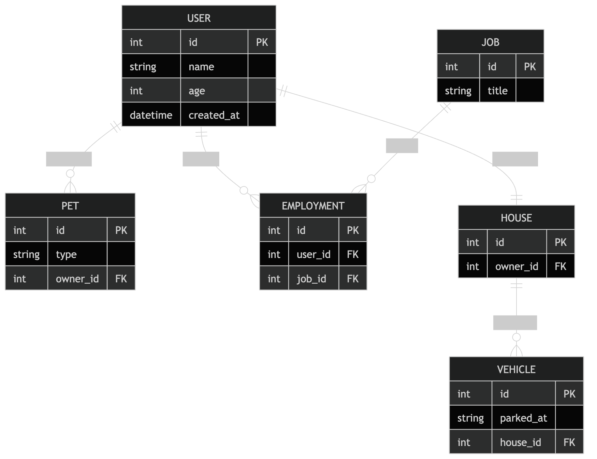

---
waltz:
  title: EGDD - RushAPI
meta:
  version: 0.0.1
  gdd authors:
    - Bruce Bermel <brbe@udel.edu>
    - John-Paul Newton <jpnewton@udel.edu>
  template authors:
    - Austin Cory Bart <acbart@udel.edu>
    - Mark Sheriff
    - Alec Markarian
    - Benjamin Stanley
---

# RushAPI

## Elevator Pitch

You are an API service that is responsible for handling user's requests. The goal is to complete these requests by writing proper API requests in a given amount of time and responding properly. The difficulty of the game comes in more endpoints being added and requests coming in more rapidly

## Influences (Brief)

- Overcooked:
  - Medium: *Game*
  - Explanation: I think the idea of a fast-paced "response to orders" style game fits the structure of API requests perfectly. I also think the idea of knowing what request to write should be second nature, so rapidly repeating this process build good habit
- Mini Motorways:
  - Medium: *Game*
  - Explanation: The simple and addicting aesthetic makes playing the game feel natural and reptitively fun
- Postman:
  - Medium: *Utility*
  - Explanation: Most accurately mirrors the actions of the user

## Core Gameplay Mechanics (Brief)

- Users with pre-set ID numbers (on shirt) make requests
- User decides what type of request and accesses "database"
- Depending on request type, user performs proper operation
- User selects proper response code to give back
- Timeout bar that can be replenished via dollars, however only a set number of dollars ever exist
- Game over when timeout
- Users can have "special requests" that give certain powerups when completed
- As game progresses, timeout speeds up and schema grows new tables

# Learning Aspects

## Learning Domains

- Database management
- API Request Types
- Handling API Request Responses
- JSON Handling

## Target Audiences

Sophomore/Junior Undergraduate CS Students

## Target Contexts

Supplementary practice for an assignment that introduces uses API calls without directly teaching them

## Learning Objectives

- Recognize API Requests*: After playing, students will be able to identify the proper API request type for a given use case
- Handle Response: After playing, students will be able to selecting the proper respsonse code for different API request scenarios
- JSON Handling: After playing, students should be able to construct proper json content for API requests
- JSON Parsing: After playing, students should be able to identify key fields in API JSON response

## Prerequisite Knowledge

- Players should be able to identify the purpose of API Requests
- Players should be able to connect the use of API requests to databases
- Players should be able to roughly identify entity relationships in databases

## Assessment Measures

### Analyze the following diagram, then use it to answer the questions below

### Q1  
If I wanted to **retrieve all pets owned by a specific user**, what table(s) would I access and what type of request should I make?  

**A:**  
- Tables: `User`, `Pet`  
- Request Type: `GET`  

---

### Q2  
If I wanted to **add a new pet to a user**, what table(s) would I access and what type of request should I make?  

**A:**  
- Tables: `Pet` (linked to `User`)  
- Request Type: `POST`  

---

### Q3  
If I wanted to **find the job associated with a specific user**, what table(s) would I access and what type of request should I make?  

**A:**  
- Tables: `User`, `Employment`, `Job`  
- Request Type: `GET`  

---

### Q4  
If I wanted to **assign a new job to a user**, what table(s) would I access and what type of request should I make?  

**A:**  
- Tables: `Employment`, `User`, `Job`  
- Request Type: `POST`  

---

### Q5  
If I wanted to **retrieve all vehicles stored at a user’s house**, what table(s) would I access and what type of request should I make?  

**A:**  
- Tables: `User`, `House`, `Vehicle`  
- Request Type: `GET`  

---

### Q6  
If I wanted to **update where a vehicle is parked**, what table(s) would I access and what type of request should I make?  

**A:**  
- Tables: `Vehicle`  
- Request Type: `PATCH` (or `PUT`)  

---

### Q7  
If I wanted to **create a new user in the system**, what table(s) would I access and what type of request should I make?  

**A:**  
- Tables: `User`  
- Request Type: `POST`  

---

### Q8  
If I wanted to **retrieve all jobs available in the system**, what table(s) would I access and what type of request should I make?  

**A:**  
- Tables: `Job`  
- Request Type: `GET`  

---

### Q9  
If I wanted to **remove a pet from a user**, what table(s) would I access and what type of request should I make?  

**A:**  
- Tables: `Pet`  
- Request Type: `DELETE`  

---

### Q10  
If I wanted to **retrieve all employment records for a user**, what table(s) would I access and what type of request should I make?  

**A:**  
- Tables: `Employment`, `User`  
- Request Type: `GET`  
- Endpoint Example: `/users/{userId}/employment`

# What sets this project apart?

- The Game is made to teach the process of API requests, which is not something that is commonly taught well or at all
- The game is made to be addicting and mindless, to simulate a developer's actions when creating API requests
- The top-down/resource management genre of game is one that does not have a lot of competitors, making it a unique experience
- The game is designed to make the user both faster and more accurate when creating API requests by revealing the process behind it, not just how to do it

# Player Interaction Patterns and Modes

## Player Interaction Pattern

This is a single-player game where the player interacts with the system by typing API requests into a text field and submitting them.

## Player Modes

-Endless Mode: The player continuously processes incoming user API requests, gaining additional time for each successful request, and the game ends when the timer runs out.

# Gameplay Objectives

- Complete API Requests:
    - Description: Players must construct correct API requests to satisfy NPC user requests.
    - Alignment: Reinforces learning of HTTP methods and endpoint structure.
- Respond Before Time Runs Out:
    - Description: The player must complete requests quickly in order to keep the timer from reaching zero. Each successful request adds additional time.
    - Alignment: Encourages rapid recognition of request patterns and reinforces repeated practice with API syntax.
- Construct Valid JSON Bodies:
    - Description: For certain requests such as POST, PUT, and PATCH, the player must correctly construct a JSON body containing the appropriate fields and values.
    - Alignment: Reinforces understanding of request payload structure.

# Procedures/Actions

Players can:
  - Select an NPC request from the queue
  - Type an API request
  - Enter a JSON body
  - Submit the request
  - View the simulated server response

# Rules

- Requests must be complete before the timer expires
- Correct requests will award points and time increase
- Incorrct requests will award no points and waste time
- Completing "boss" request grants temporary power-ups such as time slow/freeze or double points

# Objects/Entities

- NPCs requesting API operations
- "Boss" NPCs requesting API operations with higher difficulty and rewards
- Request queue which displays incoming user requests
- Terminal where the player types the request
- JSON body input where the player
- Response window displays the server's response after the submitted request

## Core Gameplay Mechanics (Detailed)

- NPCs enter a queue requesting API actions. The player can select one of the top requests and must complete it before the timer runs out. If the the player takes too long to fulfill requests the timer will run out and the player will lose.
- Players must type the correct request in a curl style format. For certain requests, players must also provide a JSON body.
- After submitting a request, the system returns a simulated API response showing either success or an error.
    
## Feedback

- 202 Accepted: Displayed when the player submits a correct API request. The response window shows a success message, the player earns points, and additional time is added to the timer.
- 404 Not Found: Displayed when the player types an incorrect endpoint that does not exist in the API.
- 400 Bad Request: Displayed when the player submits an invalid or incorrectly formatted JSON body.
- 500 Internal Server Error: Displayed when the game ends because the timer runs out, indicating that the API server has become overloaded and can no longer process requests.
- Long-Term Feedback: The player’s score, time remaining, and total successful requests indicate how well they are performing over time.
- Difficulty: As the player progresses, requests become more complex with additional endpoints and JSON body requirements, helping players track their improvement.

# Story and Gameplay

## Presentation of Rules

The beginning of the game will have a tutorial section which walks the user through the gameplay loop. Other mechanics that are unlocked later are taught through repetition and conditioning while slowly decreasing the amount of apparent information revealed to the user.

## Presentation of Content

The user will initialy be guided through the API call process via the game's tutorial and initial difficulty. The POST/GET/etc options will be revealed to the user at first and the inital difficulty level will allow the user plenty of leway when going through the process. The game's difficulty would increase by both lowering the room for error and removing the obvious instruction to encourage critical thinking. 

## Story (Brief)

The user plays as an API, and has to fulfull user requests by managing table data within a certain timeframe. The user can spend a fixed number of "time-savers" to help replenish time at any point but the timeout will lower and requests will increase in difficulty as the game progresses. The user will be given points for correct requests and will lose time or points with incorrect requests. Users can occasionally have "speial requests" that upon completion offer the user some kind of power up.

## Storyboarding

# Assets Needed

## Aethestics

A simple, top down interface similar to that of [Mini Motorways](https://www.youtube.com/watch?v=3qkgLabCByo). The sounds for correct requests will be simple and audibly pleasing to encourage the user to continue, while the incorrect requets should cause the user to feel a negative or bad feeling

## Graphical

- Characters List
  - "Characters" will be simple person icons with different colors on their shirts to signify the corresponding `user_id` in the users table
- Textures:
  - TBD
- Environment Art/Textures:
  - TBD

## Audio

- Music List (Ambient sound)
  - TBD

- Sound List (SFX)
  - Successfull Request Sound: [Pixabay](https://pixabay.com/sound-effects/film-special-effects-pop-402324/)
  - Low time sound: [Pixabay](https://pixabay.com/sound-effects/technology-alarm-478339/)

*please note that any fields marked "TBD" will be filled, along with appropriate documentation and approval from Dr. Bart*

# Metadata

* Template created by Austin Cory Bart <acbart@udel.edu>, Mark Sheriff, Alec Markarian, and Benjamin Stanley.
* Version 0.0.3
