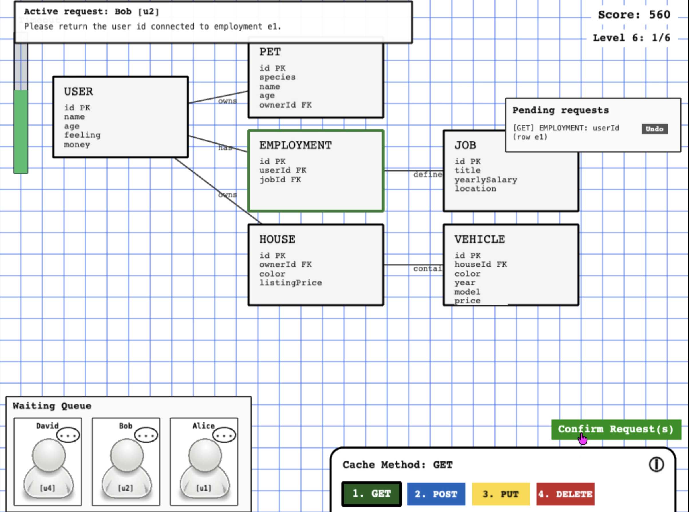

# Game Name

RushAPI

# Team Color

orange

# Developers

* Bruce Bermel (brbe@udel.edu)
* John-Paul Newton (jpnewton@udel.edu)

# Blurb

RushAPI is a game that teaches you how web APIs work by putting you in the shoes of a database administrator. A queue of customers lines up with requests; some want data looked up, others need records created, updated, or deleted. Your job is to read each request, pick the right API method (GET, POST, PUT, or DELETE), and make the correct change to the database before the clock runs out. Complete requests correctly to buy yourself more time. As you progress, the database grows more complex and the requests get harder. 

# Basic Instructions

* Click an NPC in the Waiting Queue to read their request
* Select the correct API method (GET, POST, PUT, DELETE) using the buttons or number keys 1-4
* Open the relevant table in the ER diagram and make the appropriate change
* Hit Confirm Request(s) to submit
* Completing a request adds time back to your timer
* Completing a level gives you a full time refill

# Screenshot

# Gameplay Video

Link to [video](https://drive.google.com/file/d/1RUyT3XGENJpfAMMDafnotSm41cVv6Y9f/view?usp=sharing)

# Educational Game Design Document

Link to our [egdd](docs/egdd.md)

# Credits

* [User Asset](https://www.pngfind.com/mpng/Thohbh_file-gnome-stock-person-svg-generic-person-icon/)